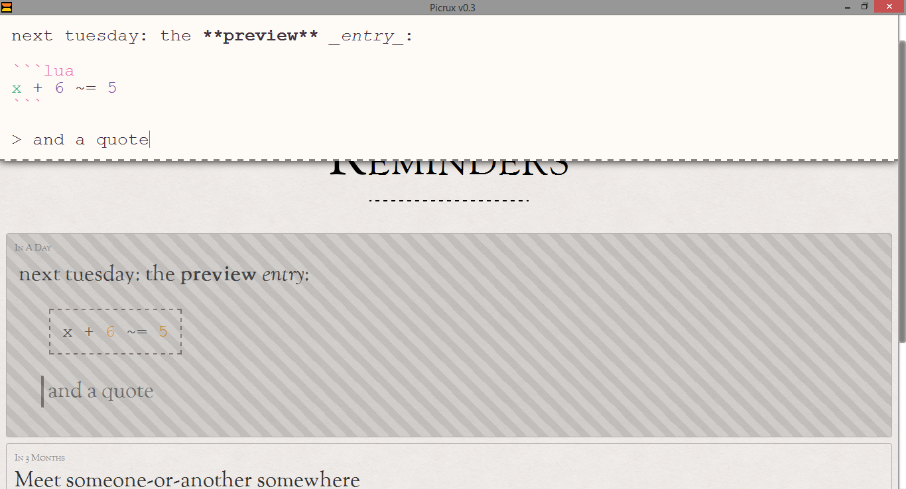

Picrux 0.3
==========
Fast, light, elegant, dead simple reminders and notes utility.

Features
--------

* **Natural language scheduling** - simply type "visit dentist tomorrow at noon" and it will set a reminder for 12:00pm tomorrow!
* **Markdown support** with syntax highlighting for dozens of programming languages! Real-time preview available.
* Usable entirely via the keyboard. Vim key bindings available.
* Dead simple interface - search, add, and edit reminder without switching contexts.

There are already a lot of reminder websites out there. Why should I use this over those?

* You're in control of your data - your reminders and notes **never have to leave your computer**.
* Fully **functional while offline**, unlike many so-called "offline apps" that limit functionality without an internet connection.
* Put it in your DropBox folder, or in a backed up location - fits anywhere in your backup regime.
* The program can be customized simply by writing code in an entry.
* You will never need to login or create an account.

Usage
-----

Picrux is written in and works with Python 3.3 or above.

This program requires PySide. This can be obtained from the [official PySide website](http://qt-project.org/wiki/Get-PySide). There are comprehensive installation instructions on the linked page.

This program is bundled with all necessary external libraries. Simply run `python3 main.py` or `python main.py` to start it.

License
-------
Copyright 2013 Anthony Zhang (Uberi)

This program is licensed under the [GNU Affero General Public License](http://www.gnu.org/licenses/agpl-3.0.html).

Basically, this means everyone is free to use, modify, and distribute the files, as long as these modifications are also licensed the same way.

Credits
-------
See links for more information about each individual module used, including descriptions and licensing information.

### [PySide](http://qt-project.org/wiki/PySide)
Python bindings for the Qt. LGPL licensed.

### [Chrono](https://github.com/wanasit/chrono)
Natural language date parser in Javascript. MIT licensed.

### [jQuery](http://jquery.com/)
Fast, small, and feature-rich JavaScript library. MIT licensed.

### [CodeMirror](http://codemirror.net/)
Versatile text editor implemented in JavaScript for the browser. MIT licensed.

### [marked](https://github.com/chjj/marked)
Full-featured markdown parser and compiler, written in Javascript. MIT licensed.

### [highlight.js](http://highlightjs.org/)
Syntax highlighting for a large number of languages, written in Javascript. BSD licensed.

### [Moment.js](http://momentjs.com/)
Javascript library impementing various date/time operations. MIT licensed.